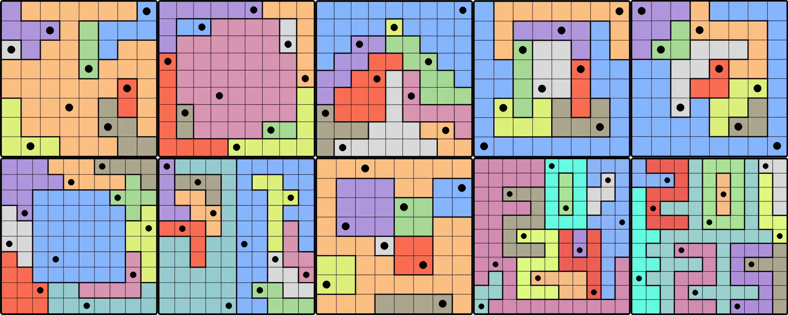

  

 

# LinkedIn's Queens Puzzle Solver

## About the puzzle 
This project provides an algorithm for solving LinkedIn's Queens puzzle game automatically. The puzzle is a visual logic game, 
where you need to fill a grid so that there is one queen in each row, column and colored region, with no queen diagonally touching another. 
A tutorial on how to play can be found [here](https://www.linkedin.com/games/queens/). 

## Computer vision and backtracking
The script consists of two stages. First, an image of the grid to solve has to be parsed, and converted into a 2-dimensional $N\times N$ array 
that encodes the colored region information. This step is done using the popular computer vision library OpenCV, as seen in [queens_parser.py](src/queens_parser.py). 
Second, a solution has to be found given this grid representation. Here, a simple backtracking strategy is used. More details can be found in [queens_solver.py](src/queens_solver.py).

## Results
The solver was tested on 20 puzzles, ranging from puzzle No. 227 to 246. With backtracking at depth 2, every puzzle was solved in under a second, with an average solve time of 0.08s. 
Full results, with images, are available at [examples](examples). 
